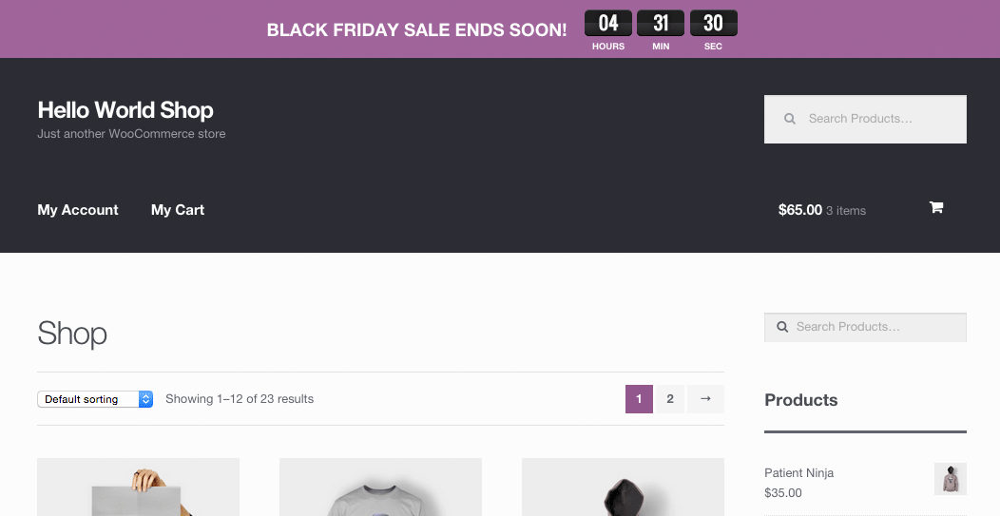
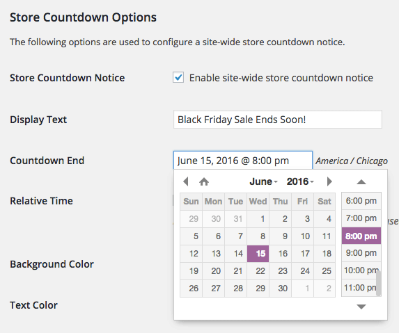
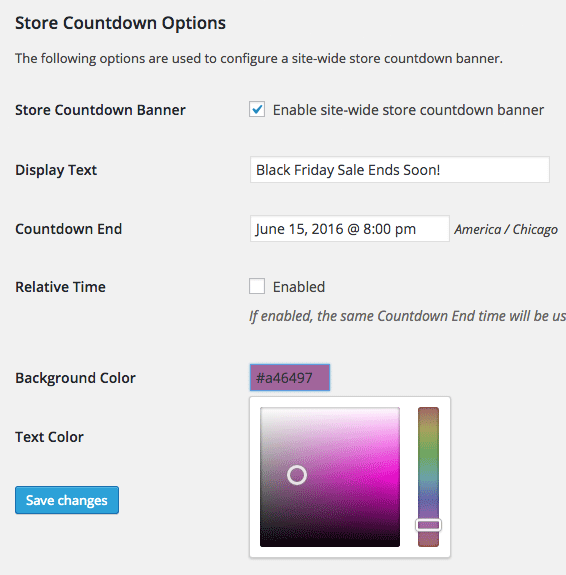

<!-- DO NOT EDIT THIS FILE; it is auto-generated from readme.txt -->
# WooCommerce Store Countdown

Description here

**Contributors:** [fjarrett](https://profiles.wordpress.org/fjarrett)  
**Tags:** [banner](https://wordpress.org/plugins/tags/banner), [ecommerce](https://wordpress.org/plugins/tags/ecommerce), [marketing](https://wordpress.org/plugins/tags/marketing), [sales](https://wordpress.org/plugins/tags/sales), [shop](https://wordpress.org/plugins/tags/shop), [shopping](https://wordpress.org/plugins/tags/shopping), [store](https://wordpress.org/plugins/tags/store), [woocommerce](https://wordpress.org/plugins/tags/woocommerce)  
**Requires at least:** 4.0  
**Tested up to:** 4.2  
**Stable tag:** 1.0.0  
**License:** [GPLv3](https://www.gnu.org/licenses/gpl-3.0.html)  
**WC requires at least:** 2.1.0  
**WC tested up to:** 2.3.8  

## Description ##

More info here

## Frequently Asked Questions ##

### I have a question? ###
This is the answer.

## Screenshots ##

### Display a countdown banner in your store for special promotions or launches!

### Simply choose a date for your countdown clock.

### And easily customize the color of your countdown banner and text.

## Changelog ##

### 1.0.0 - May 22, 2015 ###
* Initial release

Props [fjarrett](https://github.com/fjarrett)

