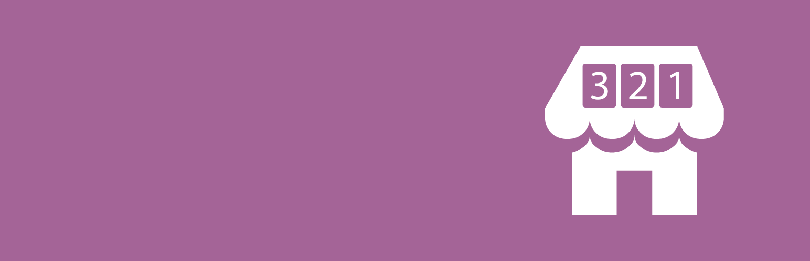

<!-- DO NOT EDIT THIS FILE; it is auto-generated from readme.txt -->
# WooCommerce Countdown Banner

Display an animated store-wide countdown banner for special promotions or launches.

**Contributors:** [fjarrett](https://profiles.wordpress.org/fjarrett)  
**Tags:** [banner](https://wordpress.org/plugins/tags/banner), [ecommerce](https://wordpress.org/plugins/tags/ecommerce), [marketing](https://wordpress.org/plugins/tags/marketing), [sales](https://wordpress.org/plugins/tags/sales), [shop](https://wordpress.org/plugins/tags/shop), [shopping](https://wordpress.org/plugins/tags/shopping), [store](https://wordpress.org/plugins/tags/store), [woocommerce](https://wordpress.org/plugins/tags/woocommerce)  
**Requires at least:** 4.0  
**Tested up to:** 4.2  
**Stable tag:** 1.0.0  
**License:** [GPLv3](https://www.gnu.org/licenses/gpl-3.0.html)  
**WC requires at least:** 2.2.3  
**WC tested up to:** 2.3.9  

## Description ##

This plugin tells your customers that they need to act fast by featuring a countdown banner above the header of your WooCommerce store.

 * Perfect for showcasing limited time offers, sales or promotions
 * Create excitement and buzz for new product launches or arrivals
 * Display before your store officially opens to build anticipation for launch
 * Customize the look and feel of your banner with just a few clicks
 * Countdown banner is fully responsive and displays on all devices
 * Advanced controls for promoting to all of your customers in multiple timezones

## Frequently Asked Questions ##

### What happens after the countdown has expired? ###
When the counter reaches zero the promotional banner will disappear automatically.

There's no need for you to remember to login and turn it off.

### How can I customize the banner more than the options allow? ###
Advanced users can target the `.wc-countdown-banner` element, and its child elements, with their own custom CSS. Feel free to reposition and style the banner however you like!

There are also two hooks available for developers to add their own markup to banners: `woocommerce_before_countdown_banner` and `woocommerce_after_countdown_banner`

### What exactly does the Relative Time setting do? ###
We're glad you asked! This setting can be a little confusing to understand at first, but it's actually very handy for stores that ship internationally.

If relative time is enabled, the countdown banner will try to detect your customers' timezones so that the same end time will apply for all customers, no matter their location.

For example, the countdown will end at **3:00pm in New York** and also at **3:00pm in Paris**. No matter where your customers are in the world, the countdown will end _at 3:00pm their time_.

In contrast, if relative time is disabled, the countdown will end at the _same moment in time_ for everyone.

For example, the countdown will end at **3:00pm in New York**, but at **9:00pm in Paris**. Because of the timezone difference between New York and Paris, this is actually the same moment in time.

## Screenshots ##

### Display an animated countdown banner in your store for special promotions or launches!

### Simply choose an end date and time for your countdown clock.

### And easily customize the color of your countdown banner and text.

## Changelog ##

### 1.0.0 - May 22, 2015 ###
* Initial release

Props [fjarrett](https://github.com/fjarrett)

